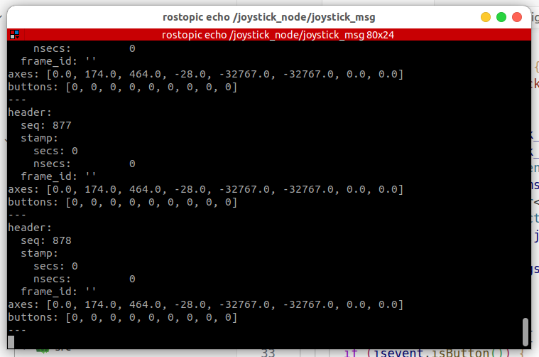

### supported

---

1. currently supported ros version:
noetic

2. currently supported joystick type:
xbox ps5 beitong_bd4a

### how to use

```bash
catkin build joystick_node
source devel/setup.bash
roslaunch joystick_node joystick_node.launch
```
<div align="center" style="margin: 20px 0;">
  
</div>

<div align="center" style="margin: 20px 0;">
  
</div>
### reference

This joystick tool is based on https://github.com/drewnoakes/joystick and unitree_mujoco

### problems
根据你提供的 joystick_node 目录结构和常见 ROS 节点开发经验，以下是可能存在的隐患和问题，以及改进建议：

可能的隐患和问题

代码健壮性不足

对于硬件（如手柄）连接、断开、异常情况处理不充分，可能导致节点崩溃或无响应。
没有对输入数据做边界检查，可能导致数组越界或非法值。
资源管理问题

文件或设备句柄未正确关闭，可能导致资源泄漏。
多线程或异步操作下，未加锁或同步，可能导致竞态条件。
日志与调试信息不足

缺乏详细的日志输出，调试和定位问题困难。
参数配置不灵活

配置参数硬编码在代码中，无法通过 launch 文件或参数服务器灵活调整。
ROS Topic/Service 命名不规范

Topic 名称未遵循 ROS 命名规范，可能导致后续集成困难。
缺乏单元测试和集成测试

test/ 目录为空或测试覆盖率低，代码质量无法保证。
文档不完善

readme.md 内容不详，缺乏使用说明、依赖说明和接口文档。
CMakeLists.txt 和 package.xml 依赖未声明完整

依赖库未在 CMakeLists.txt 和 package.xml 中声明，编译或运行时可能报错。
launch 文件未做参数化

joystick_node.launch 未支持参数化，无法灵活配置节点参数。
改进建议
增强异常处理和健壮性

在硬件连接、数据读取等关键环节增加 try-catch 或错误码判断，确保节点不会因异常崩溃。
对所有输入数据做边界检查。
完善资源管理

确保所有文件、设备句柄在析构或异常时都能正确关闭。
多线程场景下使用互斥锁等机制保证数据一致性。
增加日志输出

使用 ROS 日志（ROS_INFO, ROS_WARN, ROS_ERROR）输出关键流程和异常信息。
参数化配置

将硬编码参数改为通过 ROS 参数服务器或 launch 文件传递，提升灵活性。
规范 Topic/Service 命名

遵循 ROS 命名规范，使用命名空间和有意义的名称。
补充测试代码

在 test/ 目录下补充单元测试和集成测试，提升代码质量。
完善文档

补充 readme.md，包括安装、使用、接口说明、依赖等内容。
补全依赖声明

检查并补全 CMakeLists.txt 和 package.xml 的依赖声明。
优化 launch 文件

支持参数化启动，便于不同场景下灵活配置。
