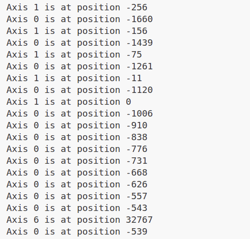

### supported

---

1. currently supported ros version:
noetic

2. currently supported joystick type:
xbox 

### how to use

```bash
catkin build joystick_node
source devel/setup.bash
rosrun joystick_node joystick_node
```


现在是按下之后会对触发的按键有响应



### reference

This joystick tool is based on https://github.com/drewnoakes/joystick

```
sudo apt install joystick
```