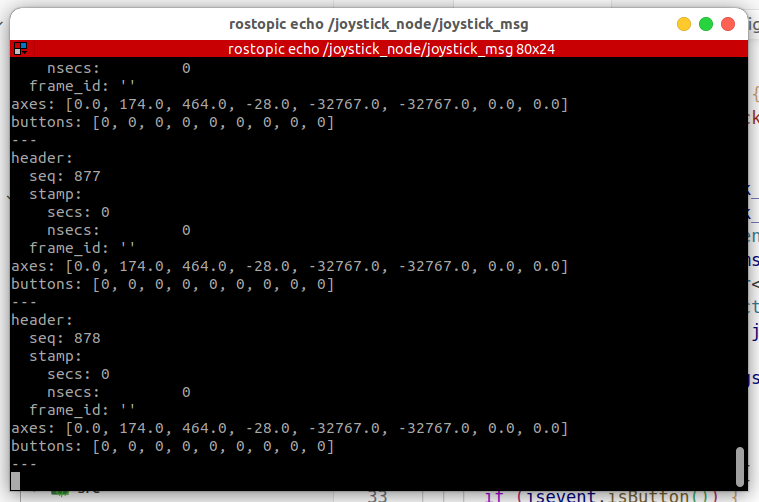

### supported

---

1. currently supported ros version:
noetic

2. currently supported joystick type:
xbox beitong_bd4a

### how to use

```bash
catkin build joystick_node
source devel/setup.bash
roslaunch joystick_node joystick_node.launch
```



### reference

This joystick tool is based on https://github.com/drewnoakes/joystick and unitree_mujoco

```
sudo apt install joystick
```